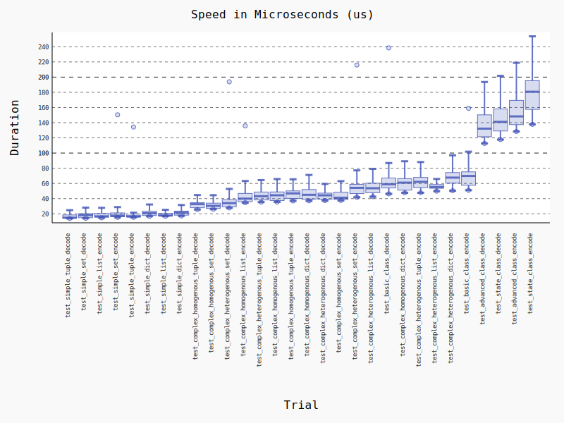
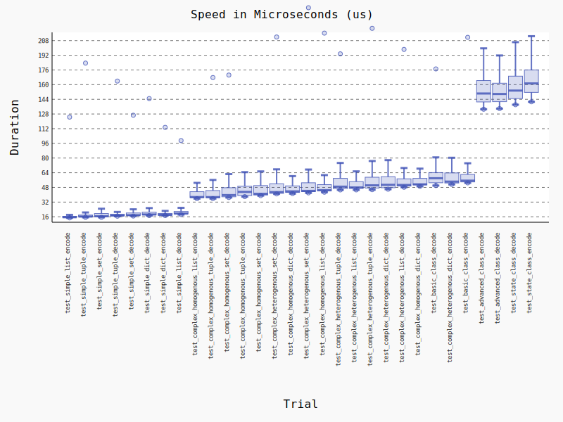
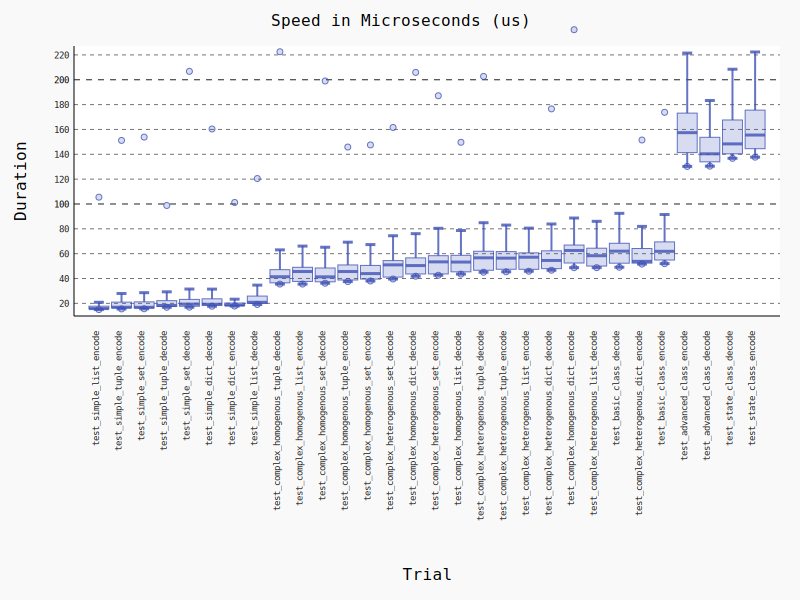
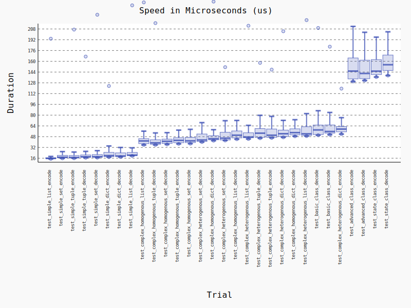
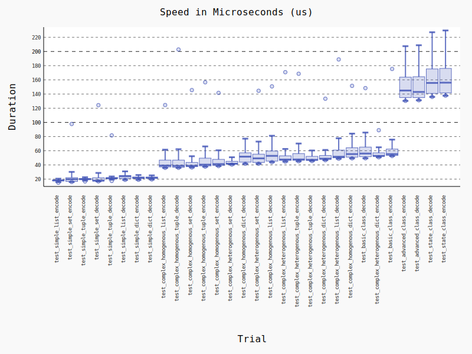

***WARNING: CERTAIN BENCHMARKS WILL SHOW VERY HIGH OUTLIER VALUES, TAKE ALL BENCHMARKS WITH A GRAIN OF SALT.***

**TL;DR**

jsonpickle 2.0.0 shows significant improvement in encoding/decoding speeds for virtually every test, the main benefits come in class encoding/decoding, but there are more minor speedups for other common use cases also. Onto the raw data!

Environment:
- Python 3.9.1
- 3 vCPU (3.8GHz Ryzen 3900X) VPS
- Ubuntu 20.04

jsonpickle 2.0.1-dev

<figure></figure>

jsonpickle 2.0.0

<figure></figure>

jsonpickle 1.5.2

<figure></figure>

jsonpickle 1.4.2

<figure></figure>

jsonpickle 0.9.6

<figure></figure>
