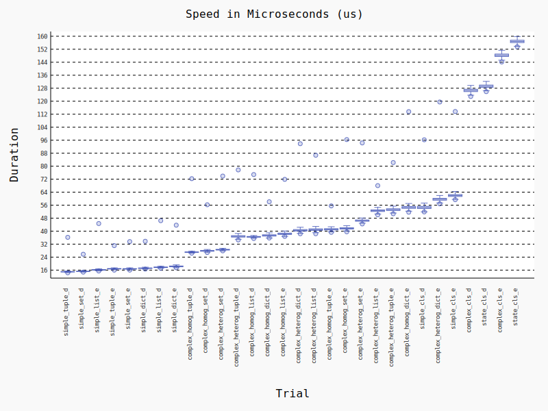

***WARNING: CERTAIN BENCHMARKS WILL SHOW VERY HIGH OUTLIER VALUES, TAKE ALL BENCHMARKS WITH A GRAIN OF SALT.***

**TL;DR**

jsonpickle 2.0.0 shows significant improvement in encoding/decoding speeds for virtually every test, the main benefits come in class encoding/decoding, but there are more minor speedups for other common use cases also. Onto the raw data!

Environment:
- Python 3.9.13
- 8-core Intel i7-11800H CPU (laptop)
- Ubuntu 20.04, Linux kernel 5.17.9 (kernel mainline ppa)
- Turbo boost disabled, plugged in + on battery

Make note of:
- If a benchmark ends with `_e`, it's an encode benchmark, if it ends with `_d` then it's a decode benchmark
- `homog` is short for homogenous, and `heterog` is short for heterogenous

jsonpickle 3.0.0-dev (drops support for python <3.7)

<figure></figure>

jsonpickle 2.2.0 (latest release of writing)

<figure></figure>

jsonpickle 1.5.2 (major performance increases reverted due to accidental breaking change)

<figure></figure>

jsonpickle 1.5.1 (major performance increases in this version)

<figure></figure>

jsonpickle 0.9.6 (please upgrade from this!)

<figure></figure>
