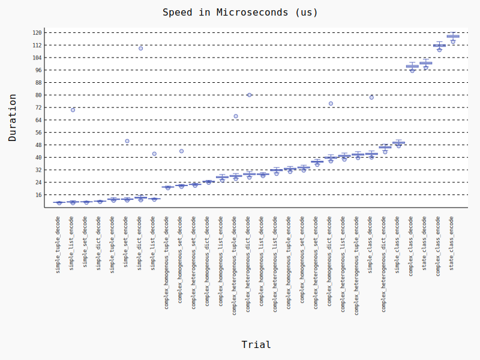
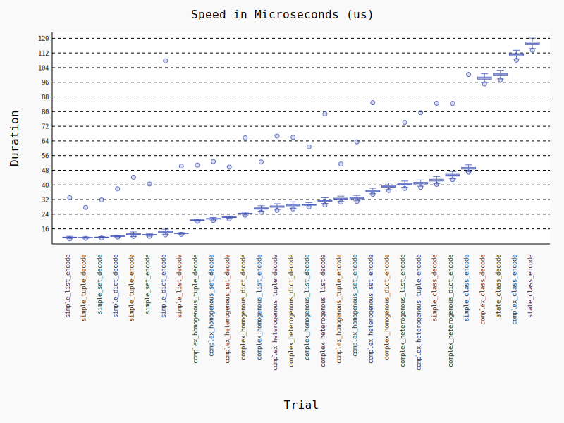
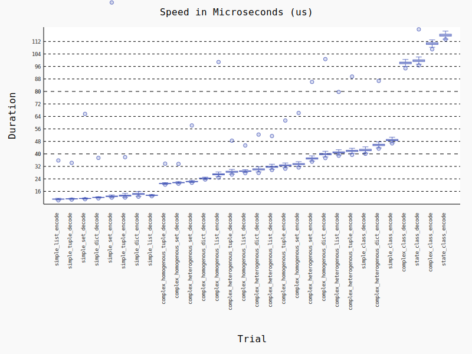
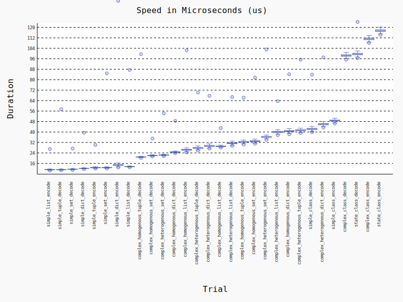
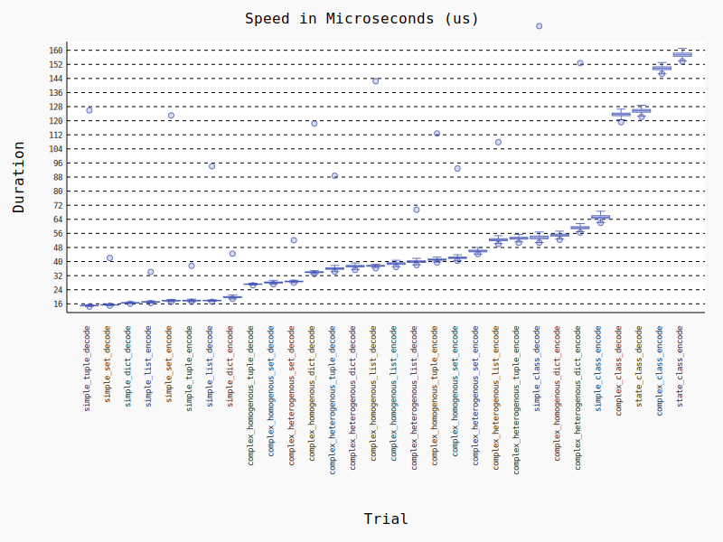
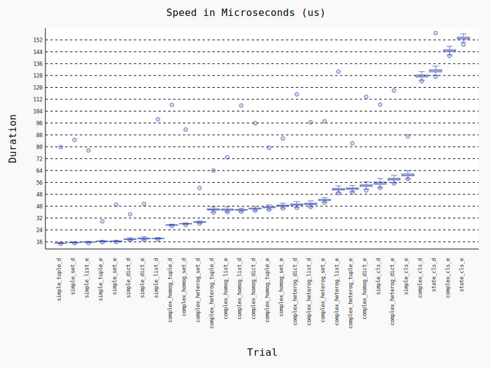
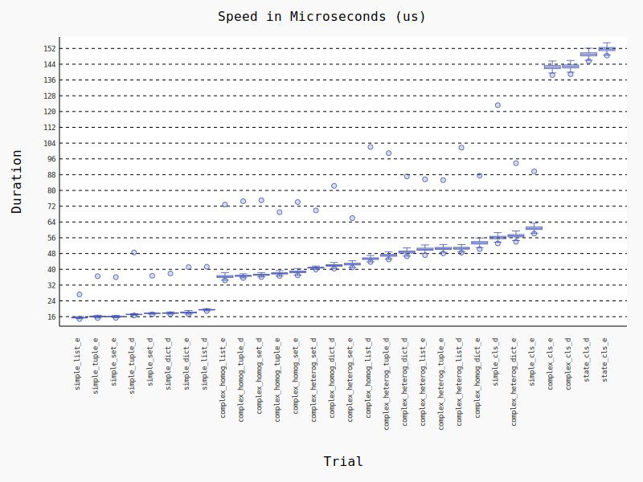

***WARNING: CERTAIN BENCHMARKS WILL SHOW VERY HIGH OUTLIER VALUES, TAKE ALL BENCHMARKS WITH A GRAIN OF SALT.***

**TL;DR**

The jsonpickle 2.x series shows significant improvement in encoding/decoding speeds for virtually every test, the main benefits come in class encoding/decoding, but there are more minor speedups for other common use cases also. Onto the raw data!

Environment:
- Tested on CPython 3.9.13 and 3.11.1
- 8-core Intel i7-11800H CPU (laptop)
- Ubuntu 20.04, Linux kernel 6.0.11 (kernel mainline ppa)
- Turbo boost disabled, plugged in + on battery

jsonpickle 3.0.0-3.11 (drops support for python <3.7)

<figure></figure>

jsonpickle 2.2.0-3.11 (last release of 2.0 series)

<figure></figure>

jsonpickle 1.5.2-3.11 (major performance increases reverted due to accidental breaking change)

<figure></figure>

jsonpickle 1.5.1-3.11 (major performance increases in this version)

<figure></figure>

jsonpickle 0.9.6-3.11 (please upgrade from this!)

<figure></figure>

jsonpickle 3.0.0-3.9 (drops support for python <3.7)

<figure></figure>

jsonpickle 2.2.0-3.9 (last release of 2.0 series)

<figure></figure>

jsonpickle 1.5.2-3.9 (major performance increases reverted due to accidental breaking change)

<figure></figure>

jsonpickle 1.5.1-3.9 (major performance increases in this version)

<figure></figure>

jsonpickle 0.9.6-3.9 (please upgrade from this!)

<figure></figure>
