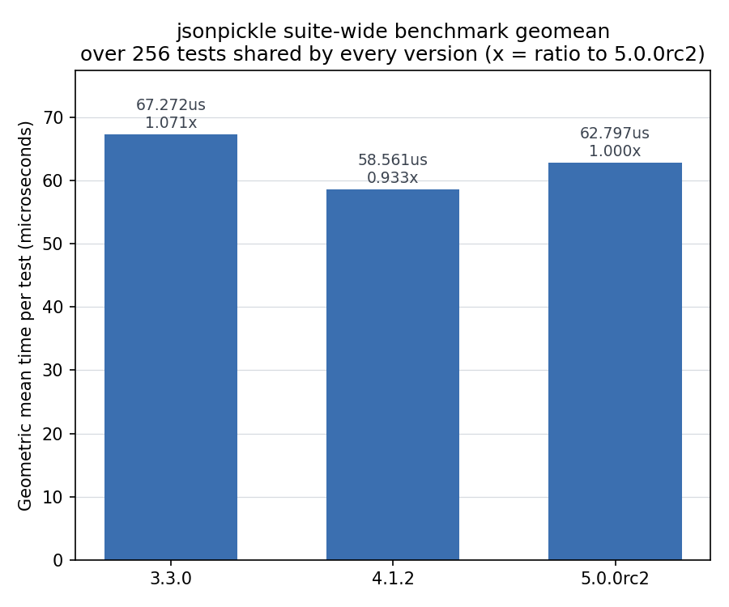
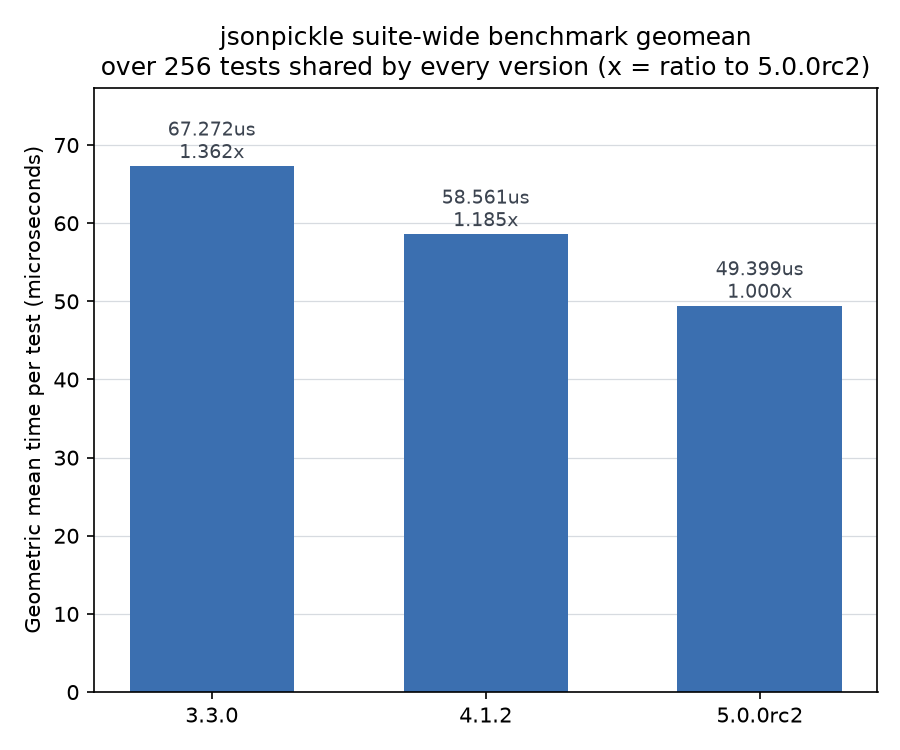
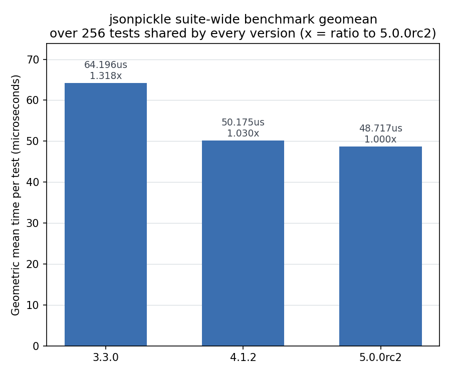
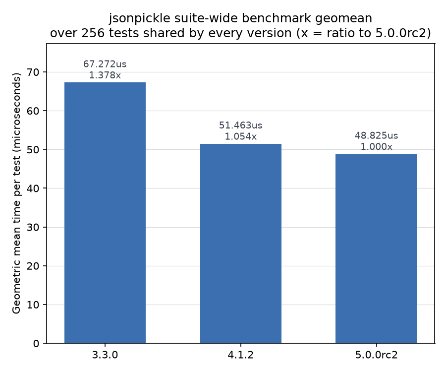

**TL;DR:**

- On older CPython versions like 3.10, all of the jsonpickle series from v3 onwards had roughly the same performance.
- On newer CPython versions like 3.11 through 3.13, v4 was a major performance boost over v3, and v5 was a minor boost over v4.

> [!NOTE]
>  The benchmarks were run across all the tests in the test suite that existed on every version tested. Because of that, the benchmarks prioritize the library performing well across many different areas of the feature space that we offer instead of just measuring how well jsonpickle performs at basic number/string (de)serialization. If you want to measure how performant jsonpickle is at only a few specific tasks that matter to you, you should run your own benchmark.

Environment:
- Tested on CPython 3.10.9, 3.11.13, 3.12.11, and 3.13.13, with jsonpickle versions 3.3.0, 4.1.2, and 5.0.0rc2.
- 16-core AMD Ryzen 7950X3D CPU, 128GB DDR5-5200 RAM
- Linux Mint 22 (Based off Ubuntu 24.04), Linux kernel 6.18.44
- All tests were run on physical core 7/16 (NUMA Node 0), with SMT disabled using the ondemand governor, NOHZ_FULL enabled for that core in grub settings, and the core's clock speed fixed to the turbo speed of 5.7GHz.
- Used this command to run:
```bash
python3 benchmarking/benchmark_versions.py 3.4.2,4.1.1,5.0.0rc2
```

jsonpickle on CPython 3.10

<figure></figure>

jsonpickle on CPython 3.11

<figure></figure>

jsonpickle on CPython 3.12

<figure></figure>

jsonpickle on CPython 3.13

<figure></figure>